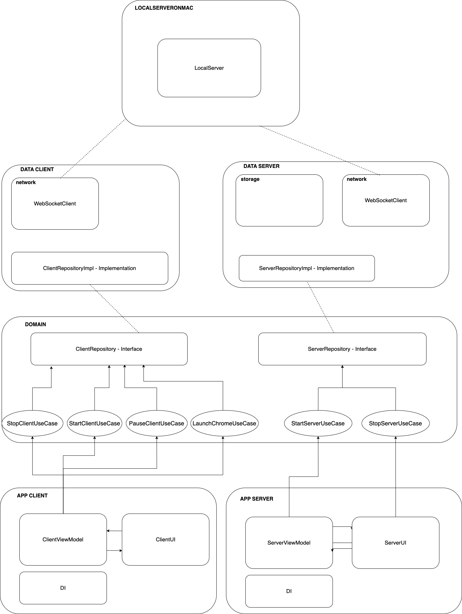

### Архитектура

### Использовался

-Dagger2
-Clean architecture
-MVVM
-Ktor
-websocket

### О проекте

Реализан локальный хост в модуле *localserveronmac*, в который разворачивает локальный
сервер по адресу localhost:8080 в сети самого ПК(МАК). Вебсокеты "хранятся" здесь. Он и определяет
от кого пришел сообщение и запоминает. и так же отправляет нужному клиенту от главного клиента

Реализован главный клиент(appserver), к которому могут подключатся некоторое количество клиентов.
Сам же главный клиент подключается к серверу из своей виртуальной сети через определенный 
адрес 10.0.2.2:8080, который был оставлен самими андроид студио

Реализован клиент, который подключается к серверу, а потом через него устанавливается обмен данными
с главным клиентом.
